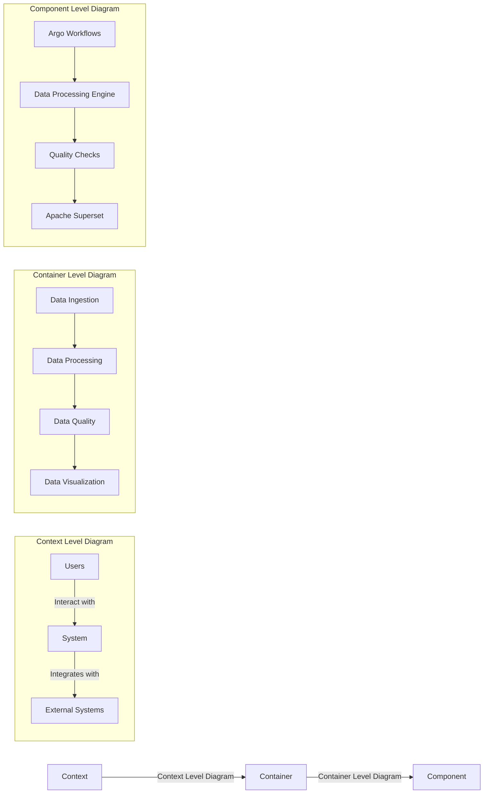

## Product Vision

Our product vision is to create a cutting-edge, end-to-end data platform that simplifies data engineering, science, and analytics tasks for businesses. Our solution will offer seamless integration of various tools and services, scalable performance, and an intuitive user interface. We aim to empower users to easily manage, analyze, and derive insights from their data, driving data-driven decision-making and fostering innovation.

## Feature Prioritization

| Feature                                      | Impact | Effort | Risk | Priority |
|----------------------------------------------|--------|--------|------|----------|
| Streamlined data pipeline                    | High   | Medium | Low  | High     |
| User-friendly interface                      | High   | Medium | Low  | High     |
| Seamless integration with Apache Superset    | Medium | Low    | Low  | Medium   |
| Extensibility and customization              | High   | High   | Medium | Medium   |

* Impact: The value provided to users and potential to differentiate our product in the market.
* Effort: The amount of development work required to implement the feature.
* Risk: The potential challenges or uncertainties associated with the feature.
* Priority: The overall priority of the feature based on the above criteria (High, Medium, Low).

## Product Roadmap

1. **Phase 1: MVP Development**
   - Streamlined data pipeline with Argo Workflows integration
   - User-friendly interface for managing data transformations and visualizations
   - Basic integration with Apache Superset

2. **Phase 2: Feature Enhancements and Optimizations**
   - Improved scalability and performance of data processing engine (DuckDB or Presto)
   - Enhanced data quality checks with Great Expectations or Soda
   - Additional customization options for users

3. **Phase 3: Expansion and Growth**
   - Support for additional data sources and tools
   - Advanced analytics and machine learning capabilities
   - Expansion into new markets and industries

## Product Requirements
### Functional Requirements
1. Users should be able to create and manage data pipelines.
2. Users should be able to create and manage data transformations.
3. Users should be able to create and manage data visualizations.
4. Users should be able to create and manage data quality checks.
5. Users should be able to create and manage data pipelines.

### Non-Functional Requirements
1. The system should be scalable and performant.
2. The system should be secure and reliable.
3. The system should be easy to use and intuitive.
4. The system should be extensible and customizable.

## Product Backlog
### User Stories
1. As a data engineer, I want to be able to create and manage data pipelines so that I can automate data processing tasks.
2. As a data engineer, I want to be able to create and manage data transformations so that I can transform data into a format that is suitable for analysis.
3. As a data engineer, I want to be able to create and manage data visualizations so that I can easily visualize data and derive insights.
4. As a data engineer, I want to be able to create and manage data quality checks so that I can ensure the quality of my data.
5. As a data engineer, I want to be able to create and manage data pipelines so that I can automate data processing tasks.\

## Architecture Overview
### Data Pipeline

### Data Transformation

### Data Visualization

### Data Quality

### Data Pipeline

## Architecture Diagram

[]: # Path: docs/README.md

It is extremely important to note that we need to ensure Data Quality upstream of ML Pipelines, trying to do it in the pipeline itself will cause unavoidable failure when working at scale. One of the recent concepts that can be leveraged here is Data Contracts.
 
Data Contract is an agreement between Data Producers and Data Consumers about the qualities to be met by Data being produced.

Data Contract should hold the following non-exhaustive list of metadata:
 
👉 Schema Definition.
👉 Schema Version.
👉 SLA metadata.
👉 Semantics.
👉 Lineage.
👉 …

Some Purposes of Data Contracts:
 
➡️ Ensure Quality of Data in the Downstream Systems.
➡️ Prevent Data Processing Pipelines from unexpected outages.
➡️ Enforce Ownership of produced data closer to the source.
➡️ Improve scalability of your Data Systems.
➡️ …

Example Architecture Enforcing Data Contracts:
 
𝟭: Schema changes are implemented in version control, once approved - they are pushed to the Applications generating the Data, Databases holding the Data and a central Data Contract Registry.
 
Applications push generated Data to Kafka Topics:
 
𝟮: Events emitted directly by the Application Services.
 
👉 This also includes IoT Fleets and Website Activity Tracking.
 
𝟮.𝟭: Raw Data Topics for CDC streams.
 
𝟯: A Flink Application(s) consumes Data from Raw Data streams and validates it against schemas in the Contract Registry.
𝟰: Data that does not meet the contract is pushed to Dead Letter Topic.
𝟱: Data that meets the contract is pushed to Validated Data Topic.
𝟲: Data from the Validated Data Topic is pushed to object storage for additional Validation.
𝟳: On a schedule Data in the Object Storage is validated against additional SLAs in Data Contracts and is pushed to the Data Warehouse to be Transformed and Modeled for Analytical purposes.
𝟴: Modeled and Curated data is pushed to the Feature Store System for further Feature Engineering.
𝟴.𝟭: Real Time Features are ingested into the Feature Store directly from Validated Data Topic (5).
 
👉 Ensuring Data Quality here is complicated since checks against SLAs is hard to perform.
𝟵: High Quality Data is used in Machine Learning Training Pipelines.
𝟭𝟬: The same Data is used for Feature Serving in Inference.
 